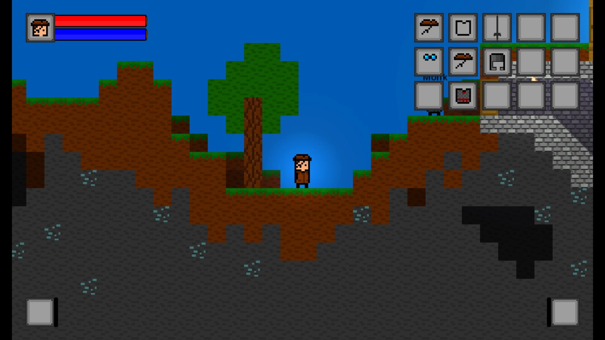
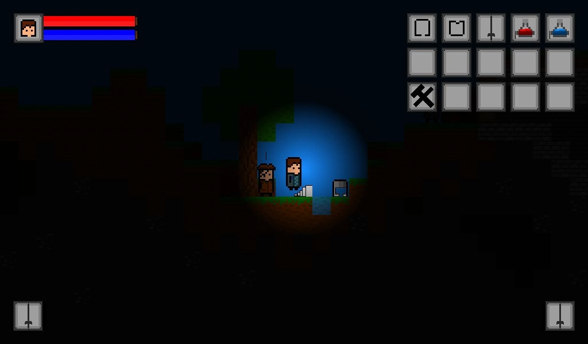
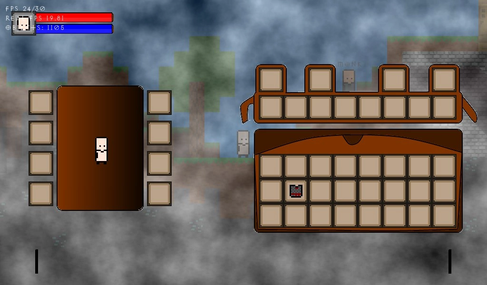
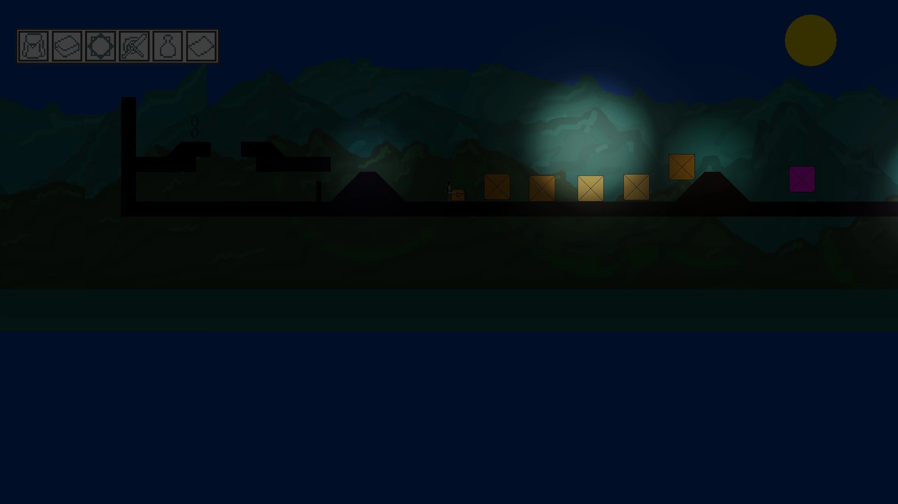
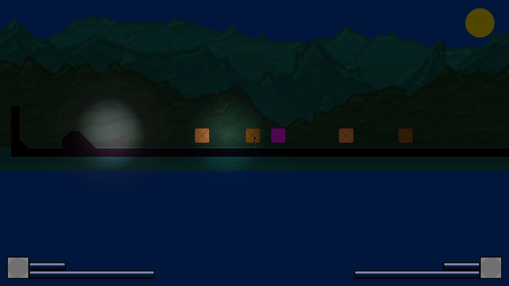
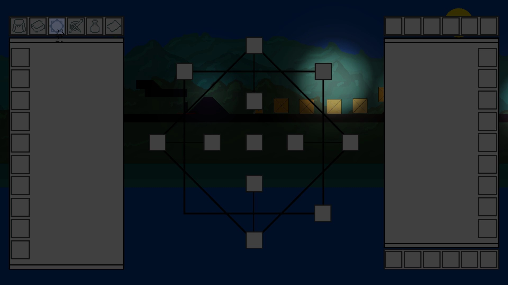
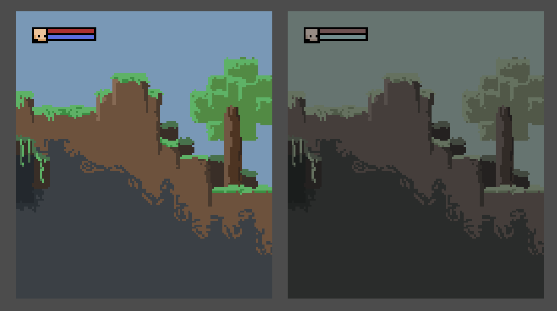
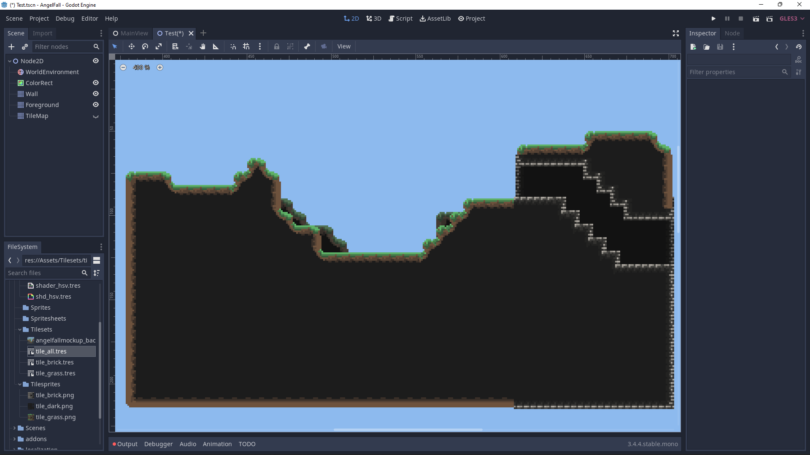
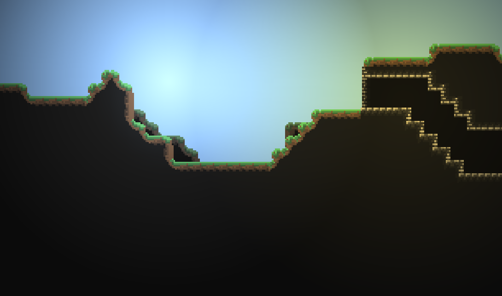
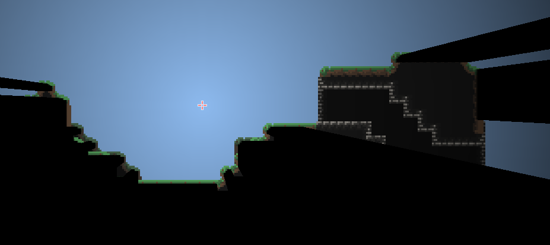

# Angelfall

This work is licensed under a <a rel="license" href="http://creativecommons.org/licenses/by-nc-nd/4.0/">Creative Commons Attribution-NonCommercial-NoDerivatives 4.0 International License (CC-BY-NC-ND)</a>.
________________

**Engine - Game Maker 8.1 / Game Maker: Studio 1**

**Language - Game Maker Language**

**Source Code - Lost**

**Executables - Multiple versions**

**Development Date - 2015 to 2022**

________________

## Description
This was my first game ever made. A small side-scrolling 2D dungeon crawler. At the time I didn't had any experience, since it was the first one, and I wasn't able to properly give it any chance on existing. Still, it was my second most worked on project and same as h.o.p.e. it had multiple iterations, none of which worked in the end as of now.

At some moment the .gm81 file containing everything for this game was lost as was lost 2nd iteration.

## Screenshots
Initial verision

 
 

2nd Iteration

 

Attempt of revival in godot

 
 
